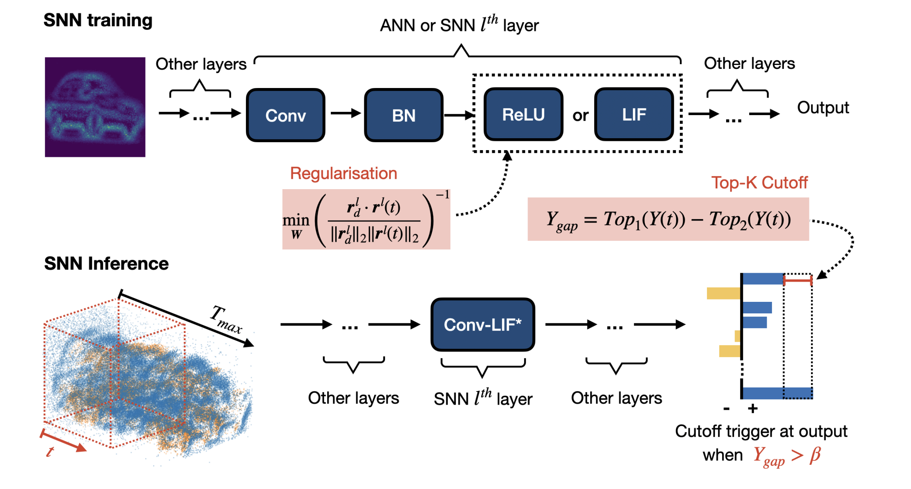

# SNN-Regularisation-Cutoff

The implmentation is also available in [SNNCutoff](https://github.com/Dengyu-Wu/snncutoff).


<p align="center">

</p>

<!-- GETTING STARTED -->
## Getting Started
To begin using this repo, clone this repository and follow the setup instructions below. 

### Installation

1. Clone the repo
```sh
git clone https://github.com/Dengyu-Wu/SNN-Regularisation-Cutoff.git
```

2. Install Pytorch
```sh
pip install -r requirements.txt 
``` 

### Training and Evaluation 
We provide training and evaluation scripts in [scripts](/scripts). 

## More detalis
For more details, please refer to the <a href="https://arxiv.org/abs/2301.09522">preprint</a>.

```
@article{wu2023optimising,
  title={Optimising Event-Driven Spiking Neural Network with Regularisation and Cutoff},
  author={Wu, Dengyu and Jin, Gaojie and Yu, Han and Yi, Xinping and Huang, Xiaowei},
  journal={arXiv preprint arXiv:2301.09522},
  year={2023}
}
```
