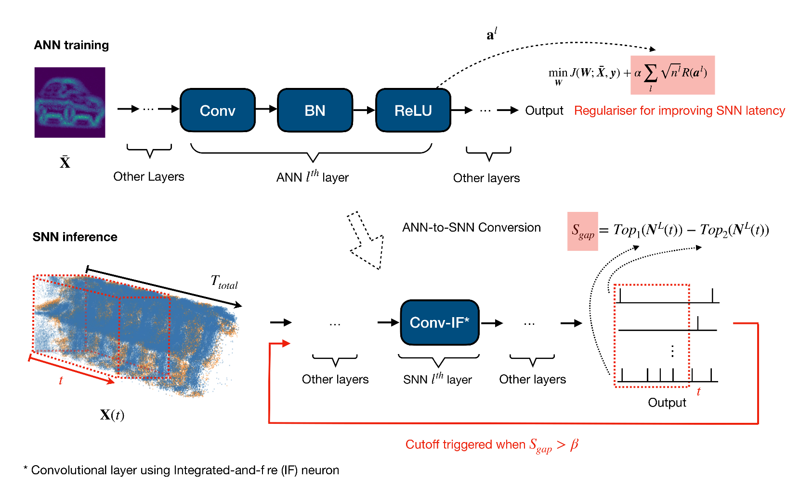

<!-- PROJECT LOGO -->

<!-- TABLE OF CONTENTS -->

<!-- ABOUT THE PROJECT -->
# SNN-Regularisation-Cuoff

Our experiment is based on [SpKeras](https://github.com/Dengyu-Wu/spkeras) with additional SpikingLayer for temporal training and Regularizer for regularization. 

<!-- LICENSE -->
## License

Distributed under the MIT License. See [LICENSE](./LICENSE) for more information.

<!-- Citation -->
## Citation
For more details, please refer to our [pre-print](https://github.com/Dengyu-Wu/spkeras) 
